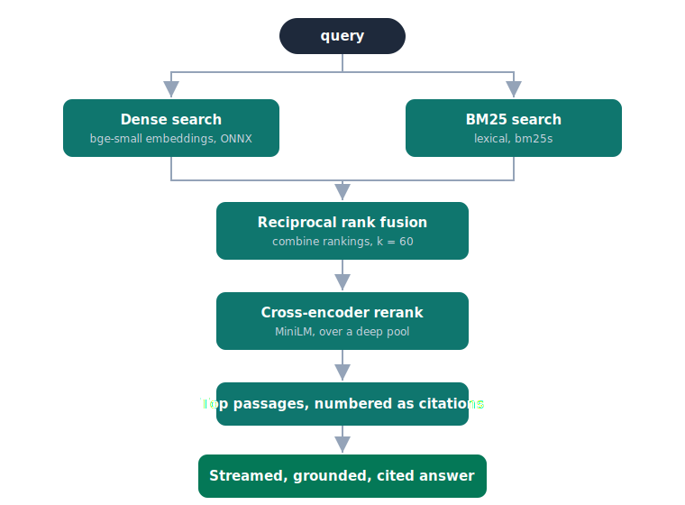

# ContextIQ

A hybrid-retrieval RAG worked example that runs on CPU.

[Live demo](https://huggingface.co/spaces/Ab-Romia/Context-Aware-AI) | [How it works](#how-retrieval-works) | [Evaluation](#evaluation)

ContextIQ indexes a document, retrieves the passages that answer a question, and writes a grounded, cited answer. It is built to be read as much as run: every stage of the pipeline is a small, separate module, and the interface shows you what retrieval did so the system is legible rather than magic.

## Why this exists

Most introductory RAG tutorials stop at four steps: split the document, embed the chunks, retrieve the top matches by vector similarity, paste them into a prompt. That gets a demo working, and it is also where the quality problems start. Pure vector search misses exact terms and struggles to separate passages that look alike. There is no sense of which retrieved chunk actually mattered, and no measurement of whether retrieval is any good.

This project implements the part that comes after the tutorial: hybrid retrieval, reranking, grounded citations, and an evaluation harness that measures the difference. It is deliberately constrained to a free CPU environment, with no GPU and no paid embedding API, because the interesting engineering is in the retrieval design, not the hardware.

## How retrieval works



Indexing turns a document into overlapping, token-bounded chunks that carry their heading path. Before embedding, each chunk is prefixed with a short contextual header built from the document title and that heading path, so an isolated chunk still records where it came from.

A query then runs two retrievers at once:

- **Dense search** embeds the query and the chunks into the same vector space and compares them by cosine similarity. It captures meaning, so it finds passages that answer the question even when they use different words.
- **BM25** is classical lexical search. It captures the exact terms dense search can smooth over: an identifier, a product name, a number, a negation.

The two rankings are combined with **reciprocal rank fusion**: each retriever contributes `1 / (k + rank)` to a chunk's score, with `k = 60`. Fusing by rank rather than raw score sidesteps the fact that cosine similarity and BM25 scores live on different scales. A chunk that ranks well in either retriever survives; a chunk that ranks well in both rises to the top.

Finally a **cross-encoder reranker** reads the query and each fused candidate together and scores their actual relevance. This is far more accurate than comparing vectors and far too slow to run over a whole corpus, so it runs only on the fused top candidates. The candidate pool is deliberately deep (50 per retriever) because reranking a handful of results changes nothing; the value appears when it pulls the right passage up from rank twenty.

The reranked top passages become numbered sources. The model is instructed to answer only from them, to cite each claim by its marker, and to say so when the sources do not contain the answer rather than fall back on training knowledge.

## Evaluation

Retrieval quality is measured, not asserted. The harness in [`eval/`](eval/) indexes a fictional company handbook together with six distractor handbooks from other invented companies that share the same section structure but none of the same facts. Retrieval runs over the whole corpus (99 chunks), so the passage that answers a question has to be found among many similar-looking ones. The golden set is 21 hand-written questions; 18 have an answer in the document, and 3 are unanswerable on purpose to test abstention.

The same questions run through four retrievers, changing only the retrieval step:

| Arm | Retriever | hit@3 | hit@5 | recall@5 | MRR | nDCG@5 |
| --- | --- | --- | --- | --- | --- | --- |
| A | TF-IDF baseline | 0.78 | 0.89 | 0.89 | 0.81 | 0.82 |
| B | Dense only | 0.67 | 0.72 | 0.72 | 0.57 | 0.58 |
| C | Hybrid (dense + BM25, fused) | 0.78 | 0.94 | 0.94 | 0.60 | 0.68 |
| D | Hybrid + rerank | 0.83 | 0.89 | 0.89 | 0.78 | 0.80 |

Read honestly, on this corpus:

- **Dense-only retrieval is the weakest arm.** A small embedding model struggles to separate near-duplicate policy passages from seven different companies. This is the naive pipeline most tutorials produce, and it is the one to beat.
- **Hybrid fusion recovers recall.** Adding lexical search puts the right passage in the top five 94% of the time, because the distinctive terms in a question (names, numbers) are exactly what BM25 keys on.
- **Reranking fixes the ordering.** Hybrid gets the right passage into the pool but not always to the top; the reranker lifts hit@3 to its best value and nearly doubles MRR over hybrid alone.

No single arm wins every metric. A properly fit TF-IDF baseline is strong here precisely because the questions are keyword-rich, which is a useful reminder that lexical search is a real baseline and not a straw man. The headline is narrow and defensible: the full pipeline gives the best precision at the top, and the naive dense-only approach is the worst.

These numbers describe one small golden set on one corpus. They are illustrative of direction, not a benchmark. The metrics are deterministic and reproducible:

```bash
pip install -r requirements.txt -r eval/requirements.txt
python -m eval.run_ab
```

An optional answer-faithfulness judge (`--judge --api-key ...`) uses the same free model that generates answers, so it shares that model's biases and is read only as a relative signal between arms.

## Run it locally

```bash
pip install -r requirements.txt
python -m app.warmup          # downloads the embedding and reranker models once
uvicorn app.main:app --reload
```

Open http://localhost:8000, paste or upload a document, index it, and ask a question. Retrieval and the trace work without any key. Generating the final answer needs an OpenRouter key, which stays in your browser and is sent only to the provider. The default model is free.

Run the tests with `pip install -r requirements-dev.txt` then `python -m pytest`.

## Deploying

The repository is a Docker Space. The image uses a non-root Python 3.11 base, installs the CPU-only stack (no PyTorch), and bakes the models in at build time so a cold start does not re-download them. Build and run it the same way the Space does:

```bash
docker build -t contextiq .
docker run -p 7860:7860 contextiq
```

## What this is not

- **Not durable storage.** The index lives in memory for the life of the process. On a free Space that sleeps after inactivity, the index is cleared on restart. This is a single-session demo by design, not a database.
- **Not multi-tenant.** There is one shared index. It is meant for one person exploring at a time.
- **Not a contextual-retrieval claim.** The chunk headers are a cheap, template-based form of contextual augmentation. They help, but they are not the model-generated per-chunk context that some published results measure, and no such gain is claimed here.
- **Not tuned to win.** The evaluation reports what the pipeline does on a small honest set, including where a stage does not help.

## Stack

FastAPI, fastembed (ONNX, `bge-small-en-v1.5`), bm25s, ChromaDB as a precomputed-vector store, langchain-text-splitters, and any OpenAI-compatible chat API for generation (OpenRouter by default). No GPU, no PyTorch.

## References

- Robertson and Zaragoza, *The Probabilistic Relevance Framework: BM25 and Beyond* (2009)
- Cormack, Clarke, and Buettcher, *Reciprocal Rank Fusion Outperforms Condorcet and Individual Rank Learning Methods* (2009)
- Nogueira and Cho, *Passage Re-ranking with BERT* (2019)

## License

MIT. See [LICENSE](LICENSE).
